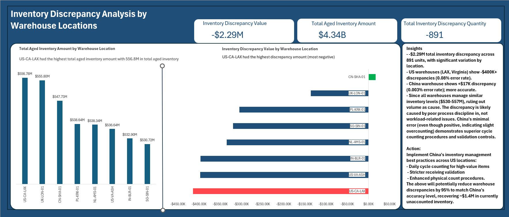
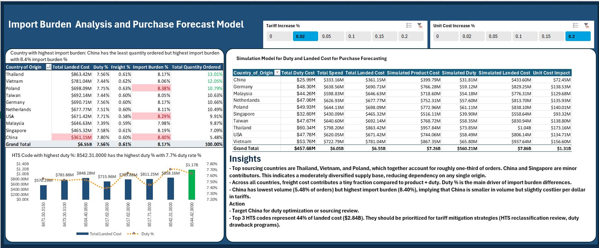
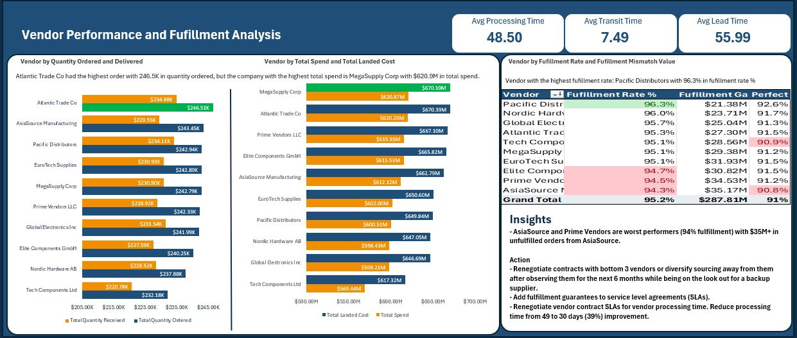

# Supply Chain Analytics Dashboard
**End-to-End Procurement Performance Analysis with Excel Power Pivot & DAX**


## 🎯 Project Overview

Comprehensive supply chain analytics project analyzing $6.5B in global procurement spend across 10 countries, 200+ products, and 10 vendors to identify cost optimization opportunities and operational inefficiencies. Developed a purchase forecast model that helps managers see the cost implication of tariff increase and unit cost increase real time and mitigate the expected impact before they happen.

**Built for:** Supply chain managers, procurement analysts, and logistics leaders needing data-driven insights to optimize procurement operations.

**Tech Stack:** Excel (Power Pivot, Power Query, DAX), Data Modeling, Statistical Analysis

---

## 📊 Business Impact

### Key Findings & Recommendations

**1. Vendor Processing Bottleneck: $300-400M Working Capital Opportunity**
- **Problem:** 87% of 56-day procurement cycle is vendor processing (48.5 days), NOT logistics (7.5 days)
- **Insight:** Optimizing carriers yields minimal gains; the constraint is vendor internal operations
- **Recommendation:** Renegotiate vendor contracts with processing time SLAs (target: reduce 48.5 to 30 days)
- **Projected Impact:** 30% cycle reduction frees $300-400M working capital currently tied in procurement pipeline

**2. Inventory Accuracy Crisis: US Operations 2-3x Worse Than Asian Sites**
- **Problem:** -$2.29M total inventory discrepancy with LAX (-$0.41M) and Virginia (-$0.40M) warehouses showing 2-3x higher errors than Asian locations
- **Root Cause:** Process discipline breakdown (not volume-related - all sites manage $530-557M inventory)
- **Recommendation:** Implement Asian warehouse best practices (cycle count procedures, validation protocols)
- **Projected Impact:** 95% Discrepancy reduction = recover ~$1.4M shortage


**3. Dead Capital Trap: $4.34B Aged Inventory**
- **Problem:** Aged inventory evenly distributed across 8 warehouses signals systemic over-ordering (not localized issue)
- **Recommendation:** 90-day demand re-forecast + aggressive SKU rationalization
- **Projected Impact:** Liquidate 30-40% aged stock = free $1.3-1.7B working capital

**4. Tariff Optimization: $22M Annual Savings Opportunity**
- **Problem:** Top 3 HTS codes account for $2.87B (44% total spend) with varying duty rates
- **Opportunity 1:** 0.5% duty reduction through HTS reclassification = $14M annual savings.
- **Recommendation:** These top 3 HTS codes should be prioritized for HTS reclassification review and duty reduction strategies.

**5. Import Burden**
- **Problem:** China has the lowest volume in terms of quantity ordered (5.48%) but the highest import burden (8.40%)
- **Recommendation:** There is a need for an urgent sourcing review for products coming from China to optimize duties being paid since freight contribution is flat across all countries.


**6. Purchase Forecast Model**
- **Insight:** The purchase forecast model provides a warning signal, telling managers that a 2% increase in tariff accompanied by a 20% increase in unit cost will take product cost from $6.05B to $7.26B, and landed cost from $6.55B to $7.86B issuing a tariff and unit cost warning. 
- **Recommendation 1**: 
	- **Negotiate with suppliers:** Lock in favorable unit pricing or volume discounts ahead of expected cost increases.
- **Recommendation 2**:
	- **Hedge tariff exposure:** Explore alternative sourcing countries or suppliers to mitigate potential tariff spikes.

**7. Variance Model**
- **Insight1:** The variance volume and price model allows the finance team to see the impact of volume and price and price on spend. Between 2023 and 2025, total landed cost remained stable with a landed cost variance of (-0.4%) which is (-21.5M) in three years.
- **Insight 2:** Quarterly changes are majorly cost driven as supplier price movements offset volume-driven volatility recorded. 
- **Recommendation1**: 
	- Protect pricing discipline at high-growth periods.
**Recommendation 2**:
	- Monitor the behavior of the suppliers during demand spikes.
**Recommendation 3**:	
- Preserve margin stability as volume expands.


**8. Strategic Category Management: No Pareto Concentration**
- **Insight:** Unlike typical 80/20 procurement patterns, all 5 product categories are strategically critical (19-25% spend each)
- **Implication:** SKU rationalization must focus WITHIN categories (consolidate 79% SKU count driving 80% spend), not eliminate entire categories.

**9. Vendor Fufillment**
- **Insight 1:** Atlantic Trade Co had the highest order in terms of quantity ordered but MegaSupply Corp is the supplier that we spent the most money with in terms of total amount spent. 
- **Insight 2:** Asia Source and Prime Vendors are our least performing vendors possessing 91% fufillment rate accumulating ~$35M in unfufilled orders each.
- **Recommendation:** Add fufillment guarantees to SLA agreement with suppliers, while looking out to changing (increasing) suppliers received from Pacific Distribution (The vendor with the highest fufillment rate).


## 🔍 Analytical Approach

### Data Processing & Modeling

**Data Volume:**
- 50,000+ procurement transactions
- $6.5B total spend analyzed
- 200+ products across 5 categories (Cable, Switch, Router, Server, Supply)
- 10 countries, 10 vendors, 8 warehouse locations
- 3-year time series (2023-2025)

**Data Architecture:**
```
Star Schema Design:
├─ Fact Table: Fact Purchase Orders (50K+ rows)
└─ Dimension Tables:
   ├─ Date (Time Intelligence)
   ├─ Product (Category, Subcategory, SKU)
   ├─ Vendor (Performance Metrics)
   ├─ Status (Geospatial Analysis)
   └─ Warehouse (Inventory Operations)
```


**Data Quality Framework:**
- Validated 99.5% data completeness
- Standardized inconsistent formats (dates, currencies, vendor names)
- Removed duplicates and reconciled discrepancies
- Implemented data validation rules ((flagged negative inventory wms, ERP different from WMS)

### Advanced Analytics Techniques

**1. Variance Decomposition Analysis**
- Isolated $8.2M cost increase drivers:
  * Volume Effect: 66% (demand growth)
  * Price Effect: 26% (vendor price increases)
  * Duty/Freight Effect: 8% (tariff changes)

**2. Cycle Time Breakdown**
- Deconstructed 56-day average lead time into components
- Identified vendor processing as primary constraint (87%)
- Calculated working capital impact of cycle reduction scenarios

**3. Inventory Discrepancy Analysis**
- Controlled for warehouse volume to isolate process quality issues
- Compared performance across 8 locations
- Root cause analysis: process discipline, not workload

**4. Pareto Analysis**
- Product-level: 79% SKUs drive 80% spend (non-concentrated)
- Category-level: Balanced distribution (no 80/20 pattern)
- Vendor-level: Identified performance outliers

**5. Scenario Planning**
- Built dynamic "what-if" analysis tool
- Modeled impact of: vendor consolidation, country diversification, tariff changes
- Enabled leadership to forecast budget impacts in real-time

---

## 📈 Dashboard Features

### Executive Summary Page
- 6 dynamic KPI cards with YoY comparisons (spend, landed cost, fulfillment rate, cycle time, quantity, freight %)
- Cycle time breakdown visualization (vendor processing vs. transit)
- Category spend balance analysis
- Strategic insights panel

### Vendor Performance
- Vendor scorecard: fulfillment rate, lead time, quality metrics
- Comparative analysis across 10 suppliers

### Geographic Analysis
- Country-level spend distribution
- Tariff burden by origin country
- Import cost analysis (duty + freight)
- Sourcing diversification opportunities

### Inventory Operations
- Warehouse-level inventory accuracy analysis
- Aged inventory distribution ($4.34B total)
- Discrepancy root cause analysis
- Working capital optimization opportunities

### Product Analytics
- SKU rationalization opportunities
- Category performance trends
- Pareto analysis (product and category level)
- Demand pattern analysis

---

## 🛠️ Technical Implementation

### Excel Power Pivot & DAX Measures (40+ Measures)

**Sample Complex DAX:**
```dax
// Total Spend YoY KPI
=VAR Curr = [Total Spend]
VAR CurrentYear = MAX(Dim_Date[Year])
VAR MinYear = MIN(Dim_Date[Year])
VAR MultiYear = CurrentYear <> MinYear
VAR PrevYear = CurrentYear - 1
VAR Prev = 
    CALCULATE(
        [Total Spend],
        ALL(Dim_Date),
        Dim_Date[Year] = PrevYear
    )
VAR ChangePct = DIVIDE(Curr - Prev, Prev)

RETURN
IF(
    MultiYear,
    "Select Year",
    IF(
        ISBLANK(Prev) || Prev = 0,
        "No Prior Year",
        IF(
            ChangePct > 0,
            "vs " & PrevYear & " ▲ " & FORMAT(ChangePct, "0.0%"),
            IF(
                ChangePct < 0,
                "vs " & PrevYear & " ▼ " & FORMAT(ABS(ChangePct), "0.0%"),
                "vs " & PrevYear & " ▶ 0.0%"
            )
        )
    )
)

// Fufillment Gap
Fufillment Gap Value = 
=CALCULATE(
SUM([Fulfillment_Gap]), 
Fact_Purchase_Orders[Data_Health_Severity]<>"Critical"
)

// Inventory Accuracy Rate
Inventory Accuracy % = 
DIVIDE(
    SUMX('Warehouse', ABS('Warehouse'[Discrepancy Amount])),
    SUM('Warehouse'[Inventory Value]),
    0
) * -1 + 1

// Volume Effect
=([Total Quantity Ordered] - [Quantity Previous Quarter]) * [Avg Unit Cost Prev Quarter]

```

### Data Transformation (Power Query)
- Automated data refresh from multiple source files
- Currency standardization (USD conversion)
- Date parsing and fiscal calendar creation
- Vendor name normalization
- HTS code validation against customs database

### Conditional Formatting & UX
- Color-coded KPI indicators (green/red YoY arrows)
- Dynamic slicer interactions (year, category, country, vendor)
- Drill-through capabilities for detailed analysis
- Mobile-responsive layout considerations

---

## 💡 Problem-Solving Methodology

**How I Approached This Analysis:**

1. **Define Business Questions**
   - What's driving cost increases? (Variance decomposition)
   - Where are operational bottlenecks? (Cycle time analysis)
   - Which warehouses have accuracy problems? (Inventory analysis)
   - What's our tariff exposure? (HTS code analysis)

2. **Data Exploration & Cleaning**
   - Identified data quality issues (missing values, inconsistent formats, negative WMS values)
   - Built validation rules and cleaning procedures
   - Documented assumptions and limitations

3. **Root Cause Analysis**
   - Went beyond surface metrics (e.g., "cycle time is long")
   - Decomposed into components (vendor processing vs. transit)
   - Controlled for confounding variables (warehouse volume)
   - Tested hypotheses with data

4. **Quantify Business Impact**
   - Translated insights into financial terms ($M savings, % improvement)
   - Calculated opportunity costs (working capital tied up)
   - Built scenarios to show "what if" impacts

5. **Actionable Recommendations**
   - Prioritized by impact and feasibility
   - Provided specific next steps (not just "improve X")
   - Quantified expected outcomes

---

## 📁 Repository Structure
```
supply-chain-analytics/
├── data/
│   ├── raw/                     # Original data files (synthetic/anonymized)
│   └── processed/               # Cleaned and validated data
├── dashboard/
│   ├── supply_chain_full_project.xlsx   # Main Excel dashboard
│   └── screenshots/             # Dashboard images
├── images/
│   ├── datamodel.jpg
│   ├── executive_summary.jpg
│   ├── import_burden.jpg
│   ├── inventory_discrepancy.jpg
│   ├── power_query.jpg
│   ├── variance_most_model.jpg
│   └── vendor_performance.jpg
└── README.md
```

---

## 🚀 Key Takeaways for Employers

**What This Project Demonstrates:**

✅ **Advanced Excel Expertise:** Power Pivot, DAX, complex data modeling, Power Query automation

✅ **Business Acumen:** Translated data into $300M+ savings opportunities, not just charts

✅ **Problem-Solving Methodology:** Systematic approach from data quality → root cause → quantified recommendations

✅ **Supply Chain Domain Knowledge:** Understanding of procurement cycles, inventory management, tariff analysis, vendor performance

✅ **Communication Skills:** Executive-level insights distilled from 50K+ transactions

✅ **Data Quality Rigor:** 99.5% completeness, validation frameworks, documented assumptions

✅ **Strategic Thinking:** Identified non-obvious insights (e.g., vendor processing bottleneck, balanced category spend)

---

## 📞 Contact

**Timothy Akintayo**  
Supply Chain & Procurement Analyst | Advanced Excel & Data Modeling Specialist

📧 timothym.akintayo@gmail.com  
💼 [LinkedIn](https://linkedin.com/in/timothy-akintayo)  
🌐 [Portfolio](https://timothyakintayo.github.io)

---

## 📝 Notes

**Data Privacy:** This project uses synthetic data modeled after real procurement patterns. All company names, vendor details, and specific values have been anonymized.

**Tools Used:** Microsoft Excel (Power Pivot, Power Query, DAX), Data Analysis, Statistical Methods

**Project Duration:** January - February 2025

**Inspired By:** Real-world procurement optimization challenges faced by global supply chain operations
